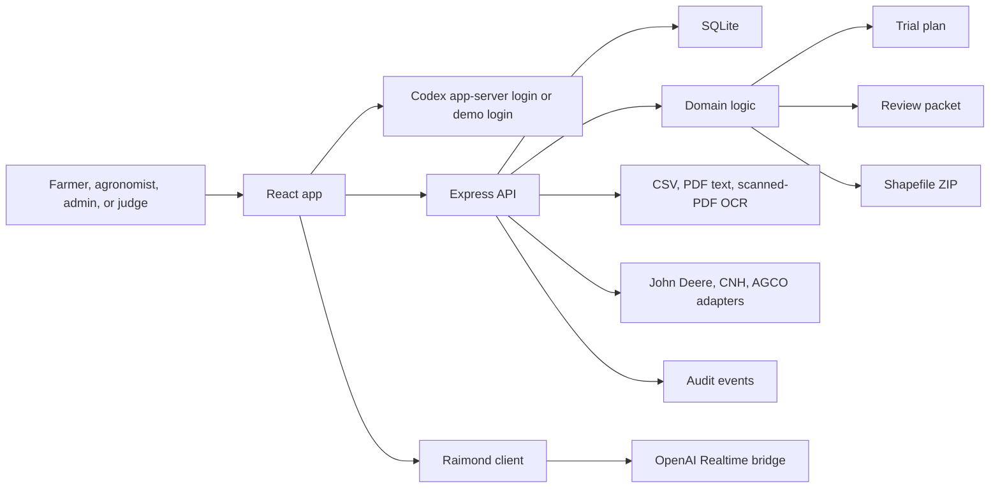

# SoilProve Product And Technical Design Brief

Date: 2026-05-21

This brief describes what SoilProve does, how it works, what it proves in the Vibeathon Cape 2026 submission, and where its boundaries are. It is grounded in the current React, Express, SQLite, Realtime, OCR, VRT, OEM, test, and documentation implementation.

## Executive Summary

SoilProve is a voice-first soil report second opinion for Midwestern corn acres. It helps a farmer and agronomist move from technical soil reports to an agronomist-reviewed action plan, modeled input savings, aggregate comparable-field context, a review packet, a real VRT shapefile ZIP, honest OEM delivery status, and post-harvest savings verification.

SoilProve is not an autonomous fertilizer recommendation system. It does not replace an agronomist, does not expose individual peer data, does not promise yield gains, and does not claim live OEM delivery unless credentials and account authorization are present. The product stance is: no black boxes, no guessing, just reviewable proof. Raimond handles basic Q&A groundwork so agronomists can spend meetings on strategy, not lab-value translation.

## Primary Users

**Farmer.** Reviews and enters field facts, imports or edits soil-report values, asks Raimond basic questions anytime, inspects the proposed action plan, sees modeled savings and breakeven yield drag, exports after signoff, and uploads harvest yield results later.

**Agronomist.** Reviews the zone rates, MRTN-style audit inputs, confidence drivers, risk caveats, comparable context, and regional review flags. Captures explicit signoff before packet, VRT, or OEM delivery. Benefits from better-prepared farmers and less repetitive explanation of basic lab values.

**SoilProve admin/operator.** Runs demo setup, manages sample users and links, inspects audit events, validates product readiness, and can operate the judge walkthrough.

**Vibeathon judge.** Needs to see the complete path in minutes: ChatGPT/demo login, soil report import, Raimond explanation, action plan, comparable-context privacy, signoff, packet, VRT, OEM status, yield verification, and Raimond voice/chat control.

## Product Promise

SoilProve reduces the risk of acting on complex soil data by making the path from report to reviewed action easier to understand, assemble, export, and verify. It turns a risky "what does this report mean, and what should I ask my agronomist?" question into a staged decision path:

1. Capture or import the soil report, field facts, and soil zones.
2. Stage any OCR/imported values for human review.
3. Let Raimond explain lab values and prepare agronomist questions.
4. Generate a draft MRTN-style action plan.
5. Explain rates, economics, confidence, and caveats.
6. Show aggregate comparable-field context only when privacy thresholds are met.
7. Require agronomist signoff before review packet and export.
8. Export a real shapefile ZIP for VRT workflows.
9. Mark OEM delivery honestly as simulated, credential-required, live, or failed.
10. Upload yield data after harvest to verify savings and assurance status.

## Product Boundaries And Claims Safety

Use this language:

- agronomist-reviewed action plan
- soil report second opinion
- better agronomist meetings, not fewer meetings
- review packet
- modeled input savings
- breakeven yield drag
- illustrative comparable-field context
- aggregate comparable-field medians
- savings assurance offer
- first controlled field test
- credential-gated OEM delivery
- John Deere simulation

Avoid this language:

- final prescription
- replaces the agronomist
- reduces the need for agronomists
- proven neighbor result
- peer identity
- guaranteed yield
- autonomous fertilizer recommendation
- live OEM delivery unless credentials are present

Savings language is allowed only as a business offer tied to reviewable inputs and harvest verification: at least $10/acre verified cost savings by Month 6, with review/adjustment if yields drop more than 2% from baseline. The app should never make that sound like a yield promise.

## Core Workflow

### 1. Authentication And Operator State

Codex app-server login is the primary path. The app exposes Codex status, starts ChatGPT login, polls login completion, and creates a signed local session when the Codex login succeeds.

Local demo login is the fallback for judging and development. Demo login still creates a real SQLite user/session and supports farmer, agronomist, and admin personas. Business APIs require an authenticated session.

The UI distinguishes app-server states such as token missing, server not running, login required, account ready, limited, and error. This makes demo failure modes legible instead of mysterious.

### 2. First-Run Onboarding

The first-run overlay teaches the safe workflow without turning the product into a landing page. It tells the operator to sign in, let Raimond fill the farm or import a report, generate a draft plan, capture signoff, create the packet, export VRT, and simulate or send OEM delivery.

Experienced users can dismiss onboarding. The main screen remains the working console.

### 3. Field Intake

The intake surface captures:

- farm, farmer, agronomist, and field names
- state, county, soil type, crop, season
- acres and previous crop
- corn price and nitrogen price
- baseline nitrogen rate and three-year baseline yield
- editable soil zones with acres, organic matter, pH, phosphorus, potassium, and polygon WKT

The domain validates state, crop, soil type, positive economics, field acres, zone acres, and soil-value ranges. Zone acres must match field acres within a 0.5 acre tolerance. Corn is the only crop supported for this submission.

### 4. Soil Report Import And OCR Review

SoilProve supports multiple import paths:

- exact-schema soil CSV
- exact-schema yield CSV
- text soil report fixtures
- text-layer PDF extraction
- scanned-PDF OCR fallback when local tools are available

Soil report import produces editable candidate field/profile patches and zone rows. Imported values can carry confidence, warnings, extracted text preview, and Missouri lab fields. OCR and detected lab-field values are review-required; they are never silently converted into an applied plan.

The UI surfaces OCR confidence and warnings, then requires the operator to mark the intake reviewed before plan generation.

### 5. Action Plan Generation

Plan generation uses pure domain logic. For each soil zone, SoilProve computes an MRTN-style nitrogen rate from:

- state-level response coefficients
- corn price per bushel
- nitrogen price per pound
- previous crop rotation
- organic matter credit
- clamp rules for corn-on-corn and corn-after-soybean
- soil confidence drivers

The output is a draft prescription with:

- per-zone nitrogen rate
- confidence label: high, medium, or low
- confidence reason
- zone rationale
- risk caveat
- organic matter credit
- pre-clamp and post-clamp values
- MRTN audit inputs
- peer summary
- modeled savings

The plan stays in `draft` status until agronomist signoff. Draft plans cannot be exported.

### 6. Economics And Savings

SoilProve computes the acres-weighted planned nitrogen rate and compares it to the farmer's baseline rate. It derives:

- applied nitrogen pounds per acre
- nitrogen saved per acre
- dollars saved per acre
- gross field savings
- breakeven yield drag in bushels per acre
- yield delta after harvest
- savings assurance trigger status

Breakeven yield drag is central to trust. It helps the farmer and agronomist see how much yield loss would erase the modeled input savings at the stated corn price.

### 7. Comparable Context And Privacy

Comparable context is aggregate-only. SoilProve filters comparable fields by state, county, soil type, prior outcome availability, and acres within 50% of the target field.

Medians are hidden until at least five comparable fields exist. When the threshold is met, the app can show median nitrogen rate, median yield, median savings, and comparability score. When the threshold is not met, the UI shows insufficient aggregate comparable data and does not expose individual farms.

The current submission uses synthetic aggregate cohorts calibrated from public soil-report and Extension-style references. Those examples are illustrative until real participating-farm outcomes exist.

### 8. Regional Soil Context

SoilProve can build a regional soil context packet from the signed prescription and deterministic source-backed facts. If OpenRouter is configured, an optional model pass turns that context into agronomist review flags and questions.

This feature does not change nitrogen rates on its own. It exists to improve review quality by surfacing context and limitations for the agronomist.

### 9. Agronomist Signoff

Signoff is a hard gate. A prescription can be signed only by an admin or linked agronomist. A farmer cannot silently self-sign. Signoff requires MRTN audit inputs and stores a note.

Once signed, the prescription can be packeted and exported. Once exported, the prescription is treated as immutable for the workflow.

### 10. Review Packet

The review packet is a markdown artifact for agronomist and farmer review. It includes:

- field identity
- savings assurance offer
- per-zone rate table
- organic matter credits
- pre-clamp and post-clamp values
- zone rationale
- confidence drivers
- risk caveats
- economics and breakeven yield drag
- aggregate comparable context or privacy-threshold warning
- regional soil insight when available
- agronomist review questions

Packet creation requires signoff. VRT and OEM export require the packet gate in the UI flow.

### 11. VRT Export

SoilProve exports a real John Deere-oriented VRT shapefile bundle. The ZIP contains:

- `.shp`
- `.shx`
- `.dbf`
- `.prj`

The DBF includes `N_RATE_LBS` for the per-zone nitrogen rate. The export is generated locally from the signed prescription and zone polygon WKT. If polygon WKT is malformed, a deterministic fallback polygon keeps the demo path from collapsing while preserving the review boundary.

Draft prescriptions cannot be exported. Export transitions the plan state to exported in the app flow.

### 12. OEM Delivery

SoilProve supports three OEM targets:

- John Deere Operations Center
- Case IH / CNH FieldOps
- AGCO / agrirouter

John Deere is optimized for deterministic demo simulation when credentials are absent. The simulation validates the bundle and reports an accepted simulated response with a deterministic response ID.

CNH and AGCO are credential-gated. When required environment variables are missing, the app returns `credential_required` with the missing credential names and endpoint shape. When credentials are present, the adapters make live HTTP calls.

Tests must never make live OEM calls. OEM tests isolate credentials and verify no accidental live network path is used.

### 13. Yield Upload And Outcome Verification

After export and harvest, the farmer or operator uploads yield results by zone. The yield CSV must use exact headers and zone IDs must match the prescription zones. SoilProve computes harvested average yield, updates savings, and reports whether the savings assurance trigger is active.

The Results screen stays locked until export. This keeps the demo honest: harvest verification is downstream proof, not a planning-time guarantee.

### 14. Admin Audit

SoilProve records audit events for important actions such as agronomist link, prescription creation, signoff, packet creation, VRT/OEM export, and yield upload. Audit events include actor, role, action, target, outcome, request ID, metadata, and timestamp.

The audit viewer is admin-focused and lives in the Results/debug lane rather than cluttering the farmer path.

## Raimond: Voice And Chat Copilot

Raimond is SoilProve's field copilot. In live voice mode, Raimond uses OpenAI Realtime with:

- model: `gpt-realtime-2`
- voice: `cedar`
- transport: browser WebRTC through `/api/realtime/session`
- data channel: `oai-events`

Raimond can also run in chat mode when microphone permissions are denied, browser support is missing, or `OPENAI_API_KEY` is not configured.

Raimond's job is workflow control and explanation, not agronomic authority. Its instructions require it to keep every recommendation tied to farmer-entered inputs, MRTN audit values, peer privacy, and agronomist review. After tool calls, it must wait for `function_call_output` before confirming success.

Supported tools include:

- `navigate_workspace`
- `advance_demo_step`
- `dismiss_onboarding`
- `load_sample_field`
- `import_sample_soil_report`
- `update_field_profile`
- `confirm_intake_review`
- `generate_prescription`
- `sign_prescription`
- `create_review_packet`
- `download_vrt`
- `upload_yield_results`
- `run_full_demo_setup`
- `reset_demo_flow`
- `send_to_oem`

The same application state can be controlled by clicks, typed Raimond chat, or live voice tool calls. Tool receipts and transcript history can be exported as a live Raimond receipt.

## Information Architecture

The app is organized as a workflow, not a loose dashboard:

1. **Field** - authentication, onboarding, field facts, soil import, editable zones, intake review.
2. **Action Plan** - generated draft/signed/exported action plan, zone rates, rationale, savings, signoff gate.
3. **Context** - aggregate comparable-field context, privacy threshold behavior, regional soil context.
4. **Review** - agronomist packet creation and packet preview.
5. **Export** - VRT shapefile ZIP and OEM status/actions.
6. **Results** - yield upload, verified savings, assurance trigger, Raimond transcript, audit viewer.

Each step has a locked/ready/active/complete state. Risky actions are disabled until prerequisites are satisfied.

## Current Architecture

SoilProve is intentionally small: React frontend, Express API, SQLite persistence, and TypeScript domain logic.



### Frontend

The frontend lives in `src/App.tsx` and `src/styles.css`. It owns the operating console, tabs, onboarding, Raimond rail, forms, import review, state gates, demo controls, and display surfaces.

The UI uses existing brand assets in `public/brand/` and should feel like a farm operations cockpit: practical, legible, evidence-forward, and calm under pressure. It should avoid generic AI gradients, fake precision, decorative fluff, and marketing-page structure.

### Domain

The domain layer lives mainly in `src/domain.ts`, with support from `src/fixtures.ts`, `src/ocr.ts`, `src/vrt.ts`, `src/oem.ts`, `src/realtime.ts`, `src/raimondTools.ts`, and `src/regionalSoil.ts`.

The domain owns validation, MRTN-style recommendations, peer summaries, savings, signoff transitions, export transitions, packet building, yield-record savings, and Realtime tool contracts.

### API

The API lives in `server/index.ts`. It exposes:

- health/bootstrap/demo-user endpoints
- Codex app-server login/status endpoints
- demo login
- authenticated `/api/v1` farms, fields, admin link/audit, soil import, OCR, prescriptions, signoff, packet, regional context, export, yield records, savings, dashboard
- compatibility `/api` prescription/VRT/OEM endpoints used by the frontend
- OpenRouter typed copilot endpoint
- OpenAI Realtime session bridge

Mutation and local Codex helper routes are guarded. Business APIs require session authentication.

### Persistence

SQLite persistence lives in `server/db.ts` using Node's `DatabaseSync`. The local database path defaults to `.soilprove-data/soilprove.sqlite`, with `SOILPROVE_DATA_DIR` override support.

The schema includes:

- users
- sessions
- farms
- fields
- soil tests
- yield records
- prescriptions
- packets
- exports
- farmer-agronomist links
- audit events

SQLite is the approved local database for this submission. It is not a fake in-memory store.

### External Services

OpenAI Realtime is used only when `OPENAI_API_KEY` is present and the browser grants microphone access. Realtime secrets stay server-side.

OpenRouter is optional for typed copilot/regional soil insights and LLM-as-judge style evaluation. Deterministic fallback paths remain available without live model secrets.

OEM live delivery depends on third-party credentials, developer app access, and customer/account authorization. The app is honest about those states.

## Data Model Summary

The active TypeScript data model includes:

- `FieldProfile`: farm, farmer, agronomist, field, location, crop, season, acres, rotation, economics, baseline practice.
- `SoilZone`: zone ID, acres, OM, pH, P, K, polygon WKT, optional sample date.
- `ZoneRecommendation`: rate, confidence, confidence reason, rationale, risk caveat, OM credit, clamp values.
- `Prescription`: status, profile, zones, recommendations, MRTN audit inputs, peer summary, savings, signoff/export timestamps.
- `TrialPacket`: prescription ID, title, markdown, created timestamp.
- `YieldRecord`: field, season, harvest date, zone yields.
- `SavingsResult`: applied rate, nitrogen saved, dollars saved, field savings, breakeven drag, yield delta, assurance trigger.
- `ToolAction`: Raimond action name and arguments.

## Demo Path

The fastest judge path is:

1. Run `npm install`.
2. Run `npm run dev`.
3. Open `http://127.0.0.1:5173/?debug=1`.
4. Click **Run full demo setup**.

That setup performs the complete deterministic path: demo login, Keller Ridge field intake, intake review, plan generation, agronomist signoff, review packet, VRT export, John Deere simulation, sample yield upload, and audit refresh.

The operator can also drive the same path through Raimond by saying or typing: "Advance the demo step."

## Verification And Acceptance

The smallest useful check depends on the change. Full checkpoint verification is:

```bash
npm test
OPENROUTER_API_KEY= npm run evals
npm run evals
npm run lint
npm run build
```

Additional focused checks:

```bash
npm run smoke:realtime
npm run evals:docs
npm run evals:packet
npm run evals:oem
npm run evals:security
npm run evals:prod-hardening
npm run evals:walkability
```

The docs requirements gate treats `docs/files/SPEC.md`, `docs/files/PROGRESS.md`, `docs/SoilProve Source Pack Combined Markdown - JUDGING RUBRIC.md`, and `docs/files/SPEC_ADDENDUM_TONIGHT.md` as the source floor. Approved equivalents and external dependencies are explicit rather than hidden as implementation gaps.

## Known External Dependencies

Production OEM write-back is the main external dependency. SoilProve can generate and validate the VRT bundle locally, and it can simulate or credential-gate OEM delivery, but real production upload requires OEM app credentials, customer authorization, account IDs, and successful integration approval.

Live Raimond voice also depends on `OPENAI_API_KEY`, browser support, secure context or localhost, and microphone permission. Chat fallback preserves the demo path when voice is unavailable.

## Design Direction

The UI should remain a working farm operations console, not a marketing site.

Visual direction:

- quiet operations cockpit
- credible, sturdy, reviewable, field-ready
- deep field green, crop green, paper neutral, soil/clay accent, dark soil ink
- compact readable typography
- dense but scannable forms and status surfaces
- visible gates and audit states

Avoid:

- purple/blue AI gradients
- glossy fintech styling
- fake confidence percentages
- decorative orbs
- gamified farming metaphors
- oversized hero sections inside the app
- generic "AI dashboard" language

Use existing assets from `public/brand/`:

- `SOILPROVE-MARK-TRANSP.svg`
- `LOGOMARK_wt.svg`
- `SoilProve_text-only.svg`

Do not invent replacement logos. Derive any compact badge or loading mark from the existing brandmark/logomark.

## Design-Tool Prompt Appendix

Use this if generating a UI concept in Google Stitch, Claude Design, Figma, or a similar tool:

Design a production-quality UI concept for SoilProve, a voice-first soil report second opinion for Midwestern corn acres. The audience is Midwestern farmers, agronomists, and hackathon judges. The app must feel like a quiet farm operations cockpit: credible, practical, evidence-forward, and readable in a pickup cab or office. Use the existing brand assets from `public/brand/`: `SOILPROVE-MARK-TRANSP.svg`, `LOGOMARK_wt.svg`, and `SoilProve_text-only.svg`. Do not invent a replacement logo.

The product is decision support, not an autonomous fertilizer optimizer. Preserve these required flows: Codex app-server login with local demo fallback, first-run onboarding, editable field and economics intake, PDF/text soil report import with review-required OCR values, soil zone editor, Raimond explanation and agronomist meeting prep, generated draft action plan, per-zone N rates with rationale/confidence/risk caveats, aggregate comparable-field context with medians hidden until at least 5 comparable fields exist, modeled input savings, breakeven yield drag, agronomist signoff before export, review packet creation, real VRT shapefile ZIP download, John Deere/Case IH/AGCO OEM status cards, yield CSV upload with verified savings, admin audit trail, and Raimond voice/chat readiness using `gpt-realtime-2` with voice `cedar`.

Show the main working app, not a landing page. Include disabled/precondition states for signoff, packet, VRT, OEM, OCR review, yield verification, and live voice readiness.
