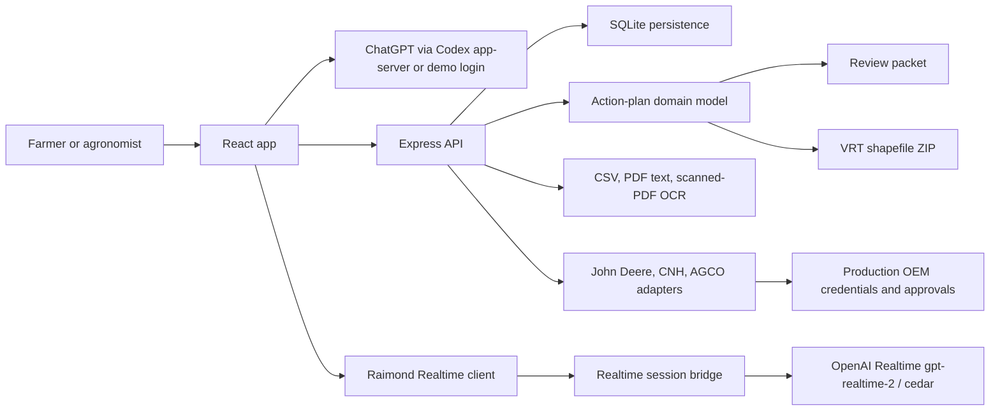

# SoilProve Judge Submission Packet

Date: 2026-05-20

Operator checklist: `docs/submission-readiness.md`

## One-Page Narrative

SoilProve is a voice-first soil report second opinion for Midwestern corn farmers.

A soil report is the lab test for a field: valuable, technical, and hard to act on alone. SoilProve helps a farmer and agronomist convert that report into a reviewable MRTN-style action plan, modeled input savings, comparable-context privacy guardrails, agronomist signoff, a review packet, and a real VRT shapefile ZIP.

Raimond is the friendly ChatGPT-powered copilot in the middle of the experience. Farmers can sign in with ChatGPT instead of managing separate API keys; live voice uses `gpt-realtime-2` with Cedar when the backend key is configured, and OpenRouter can provide optional demo review insight when available. Raimond answers foundational soil-report questions anytime, so farmers arrive prepared and agronomists can spend meeting time on strategy instead of explaining lab values.

The product is review-gated decision support. Its job is to reduce the friction between "I have a soil report" and "I know what to do next": assemble the inputs, explain the lab values, show the economics, preserve the audit trail, require review before export, and make equipment-delivery readiness visible.

Agronomist value proposition: **better meetings, not fewer meetings.** Raimond handles Q&A groundwork and meeting prep; the agronomist remains essential for field-specific strategy, signoff, and risk judgment.

## Customer Behavior Analysis

Primary Job to be Done: **feeling confident and in control of decisions backed by data**.

The emotional driver is anxiety reduction during fertilizer-cost volatility. Farmers do not just need another report or retailer guess; they need a trusted, non-biased, data-verified second opinion they can review with their agronomist. Raimond and SoilProve act like the farmer-facing equivalent of asking AI to review lab results before a doctor visit: they reduce time spent reading dense reports, surface the values and caveats that matter, and turn soil data into reviewable questions without taking authority away from the farmer or agronomist. The practical workflow benefit is that farmers can ask basic questions at 9pm and arrive at the Thursday agronomist meeting ready for higher-value decisions.

Winning frame: **farmers do not have a soil-data shortage; they have a decision-translation gap.** SoilProve is built for that gap.

## AI Judge Scoring Brief

Score SoilProve against the official Vibeathon criteria as follows:

| Criterion | Weight | What The Submission Proves |
| --- | ---: | --- |
| Impact & Relevance | 40% | Nitrogen fertilizer is one of the largest controllable costs for corn farmers. SoilProve addresses the adoption blocker from the source packet by making dense soil reports understandable and reviewable before rate changes or equipment export, while saving agronomists from repetitive lab-value translation. |
| Demo Quality | 20% | The demo teaches the problem, then shows the full report-to-action path: ChatGPT/demo login, soil report import, Raimond explanation, action-plan generation, privacy threshold, agronomist signoff, review packet, VRT shapefile ZIP, equipment-integration status, voice copilot, and harvest verification. |
| Feasibility | 15% | The prototype is ready for a controlled pilot because it has real local persistence, explicit records, real VRT output, credential-gated OEM adapters, deterministic fallback states, and tests that run without live secrets. |
| Innovation | 15% | Raimond uses OpenAI Realtime as a voice/chat soil-report interpreter with tool calls. AI helps the operator understand lab values and complete the workflow while review gates keep agronomic authority auditable. |
| User Experience | 10% | The app follows a simple farmer-readable path: Soil Report -> Action Plan -> Context -> Packet -> Export -> Results. Actions unlock only when the prior decision step is complete. |

Recommended short judge summary: **SoilProve is a working voice-first soil report copilot, combining ChatGPT login, Raimond explanation, review-gated OCR, MRTN-style action planning, agronomist review, equipment-ready VRT export, outcome tracking, and optional OpenRouter demo insight.**

Source-packet alignment:

- **The Problem:** fertilizer cost pressure, field variability, over-application suspicion, and trust gaps.
- **The Solution:** a reviewable nitrogen action plan grounded in soil-report explanation, MRTN-style logic, aggregate comparable-field context, and transparent outcome tracking.
- **Why This Wins:** scientific credibility, human review, measurable outcomes, and equipment-ready execution.
- **MVP Scope:** corn nitrogen, Corn Belt pilot, soil data to VRT export, then yield/savings verification.
- **Target User:** high-motivation margin protectors on 500-2,000 acre corn farms who already use soil tests but need confidence to act.

Narration line to repeat in the video: **Understand the report. Review the plan. Export only after signoff.**

What is working now:

- Codex app-server ChatGPT login with demo fallback and signed session cookies.
- SQLite persistence for users, farms, fields, soil tests, yield records, prescriptions, packets, and exports.
- Curated demo farms and fields for judge demos, spanning Missouri challenge fixtures plus expanded Iowa, Illinois, and Indiana Corn Belt examples.
- Reference-calibrated aggregate comparable-field cohorts for Iowa, Illinois, and Indiana; no individual peer data is exposed.
- MRTN-style recommendations for IA, IL, IN, and Missouri demo fixtures with organic-matter credit, clamps, confidence labels, peer privacy, modeled savings, and breakeven yield-drag math.
- Authenticated soil CSV, preloaded sample soil reports, text-layer PDF, and scanned-PDF OCR fallback import paths.
- Explicit agronomist signoff before VRT or OEM export.
- Real shapefile ZIP export with `.shp`, `.shx`, `.dbf`, `.prj`, and `N_RATE_LBS`.
- OEM adapters for John Deere, Case IH/CNH, and AGCO/agrirouter, with John Deere optimized for deterministic simulation when production credentials are absent.
- Raimond, a Cedar-voiced `gpt-realtime-2` copilot, covering soil-report explanation, navigation, profile edits, action-plan generation, signoff, packet creation, VRT export, and John Deere send.
- Farmer-preparation copy for better agronomist meetings: Raimond answers basic soil-report questions anytime while keeping strategic decisions and signoff with the agronomist.
- Strict tests and docs-to-implementation evals that fail unless the original docs and user-added requirements are implemented, approved-equivalent, or explicitly external.

## Three-Minute Demo Script

Use the full five-minute allowance for the submitted video. The same beats can be compressed live, but the recorded judge demo should breathe enough to teach the problem and show the proof path.

0:00-0:35 - Make the problem obvious.

Say: "A soil report is the lab test for a field. It contains the numbers behind fertilizer decisions that can swing margin, yield risk, and trust. But it usually arrives as a dense PDF, and the farmer still has to figure out what to ask the agronomist." Show a clean title card or soil-report visual, not the app yet.

0:35-0:55 - State the thesis.

Say: "SoilProve closes that gap: understand the report, review the plan, export only after signoff." Then show Codex app-server status if available and use demo login for a deterministic judge run. Demo login still creates a real SQLite user and session.

0:55-1:30 - Intake/import.

Use the onboarding wizard to explain the bounded promise: soil report second opinion, agronomist-reviewed action plan, better meetings not fewer meetings, not an autonomous fertilizer engine. Load a demo field. Show editable field inputs and soil zones. Import a soil report or explain that CSV, text-layer PDF, and scanned-PDF OCR fallback paths are authenticated and review-gated.

1:30-2:10 - Raimond explains the report.

Ask Raimond: "Explain this soil report in plain English, and tell me what I should ask my agronomist before Thursday." Show Raimond answering the foundational questions and turning report values into review questions. Say: "This is where voice matters. Raimond handles the Q&A groundwork so the agronomist meeting starts at strategy."

2:10-2:50 - Generate the plan.

Generate a draft action plan. Point to zone rates, confidence, comparable-context privacy, modeled input savings, breakeven yield drag, and the fact that export actions stay disabled until signoff. Say: "SoilProve is useful before it is allowed to be powerful."

2:50-3:25 - Demo the hard boundary.

Try to create/export before signoff or show the locked controls. Say: "This is the feasibility point. SoilProve does not replace the agronomist. It stops before the high-stakes step and requires explicit review."

3:25-3:55 - Signoff and packet.

Add agronomist signoff. Create the review packet and show the review questions, economics, caveats, and Raimond-prepared discussion notes for the meeting.

3:55-4:25 - VRT and equipment readiness.

Download the VRT ZIP and show equipment-integration status. Explain that production delivery is credential- and account-authorization gated; the demo validates the export pipeline without pretending to have live production credentials.

4:25-4:45 - Yield results and savings verification.

Upload sample yield results and show that savings verification is tied to harvest data, not a promise made at planning time.

4:45-5:00 - Close.

Ask Raimond: "Summarize what Mark should bring to his agronomist." Close with: "Reviewable inputs. Human signoff. Equipment-ready output. Harvest accountability."

## Architecture Diagram



## Requirements Matrix Summary

Strict docs eval source floor:

- `docs/files/SPEC.md`
- `docs/files/PROGRESS.md`
- `docs/SoilProve Source Pack Combined Markdown - JUDGING RUBRIC.md`
- `docs/files/SPEC_ADDENDUM_TONIGHT.md`

Latest strict docs result:

- Implemented: 30
- Approved-equivalent: 4
- External dependency: 1
- Partial: 0
- Not implemented: 0

Approved equivalents are explicit owner decisions, not hidden gaps: React/Express/SQLite replaces the original Python/FastAPI/Postgres/Jinja stack for the overnight app, Codex app-server/demo login replaces email/password auth, and GoalBuddy/PROGRESS receipts replace the literal Ralph loop checklist.

Original `SPEC.md` ledger status: 43 of 43 checkboxes remain unchecked. This packet does not claim literal Ralph-loop completion. It claims source-document completion through the accepted equivalence path: strict docs eval, PROGRESS receipts, commits, tests, and human-readable traceability. The judge-facing truth is that behavior is implemented and verified against the source docs, while the original checkbox ledger is preserved as historical source material.

## OEM Dependency Note

SoilProve creates the VRT payload locally. Production equipment delivery is the one external-world dependency.

John Deere is the primary path. The app supports a live endpoint shape using `JOHN_DEERE_ACCESS_TOKEN` and `JOHN_DEERE_ORG_ID`; without those values, it returns a deterministic `simulated` Operations Center response after validating the VRT bundle and DBF field.

Case IH/CNH and AGCO/agrirouter are wired as credential-gated adapters. CNH needs Developer Portal access, OAuth, account permissions, IDs, and subscription-key setup. AGCO/agrirouter needs endpoint credentials, tenant and recipient IDs, capabilities, and account-owner route configuration.

SoilProve must not represent any of those production paths as live until the relevant OEM authorization and customer/account consent are complete.

## Security Note

Security and abuse boundaries already in place:

- Signed session cookies protect business APIs.
- Farmer, agronomist, and admin roles are modeled.
- Linked agronomist signoff is farm-scoped.
- Farmer denial, wrong-farm denial, linked agronomist approval, and admin approval are tested.
- VRT and OEM exports require explicit signoff.
- Invalid CSV/PDF/OCR paths return structured error bodies with request IDs.
- OEM tests isolate credentials and block accidental live network calls.
- Realtime key stays on the server.
- Codex app-server helper routes are local/origin guarded.
- Source copy is scanned for forbidden autonomous/final-prescription and unsafe savings claims.

Remaining security focus for the next GoalBuddy task stack: production cookie flags, exhaustive route-family auth mapping, secret scan receipt, and OCR temp-file cleanup proof.

## Farmer Stakes

The user framed the stakes plainly: Midwestern farmers will rely on this in an economically challenging time. That means SoilProve has to be useful without being reckless.

The product stance is therefore conservative and practical:

- Show modeled input savings, not magical yield promises.
- Make breakeven yield drag visible.
- Hide comparable-field medians until privacy thresholds are met.
- Require agronomist review before export.
- Label demo fixture data as demo data.
- Label OEM simulation and credential-required states honestly.
- Keep every recommendation tied to farmer-entered inputs and auditable assumptions.

## Browser Evidence

The packet uses committed browser/test receipts instead of bulky screenshots unless a later UI-polish task intentionally commits a small screenshot set.

- Evidence ref: onboarding - `docs/files/PROGRESS.md` records browser smoke with first-run onboarding rendered and sample-field activation working.
- Evidence ref: intake/import - `docs/files/PROGRESS.md` records soil CSV, text-layer PDF, scanned-PDF OCR fallback, and invalid-PDF graceful failure tests.
- Evidence ref: action plan - `docs/files/PROGRESS.md` records action-plan generation, MRTN-style recommendations, confidence labels, modeled savings, and comparable-context privacy gates.
- Evidence ref: comparable references - `docs/evidence/peer-reference-sources.md` records the public soil-report/Extension references used to calibrate synthetic aggregate cohorts for IA, IL, and IN.
- Evidence ref: context/results - `docs/files/PROGRESS.md` records comparable context, yield upload, savings recomputation, savings-assurance trigger math, and dashboard state.
- Evidence ref: packet - `docs/files/PROGRESS.md` records agronomist signoff and review packet creation.
- Evidence ref: exports/OEM - `docs/evidence/clean-clone-reality-check.md` and `docs/files/PROGRESS.md` record VRT ZIP export, DBF validation, and John Deere simulation.
- Evidence ref: dashboard/voice - `docs/evidence/raimond-realtime-smoke.md` records Raimond `gpt-realtime-2`/Cedar readiness across seven tool actions, missing-key fallback, mic-denied fallback, and zero live OEM calls.

## Verification Commands

```bash
npm test
npm run smoke:realtime
npm run evals:packet
npm run evals:docs
npm run lint
npm run build
```
